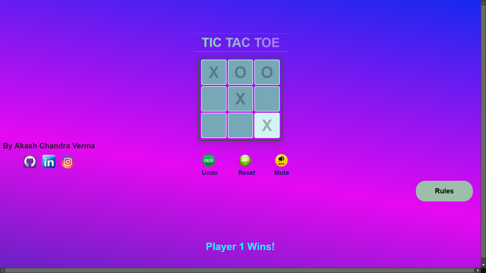

  <b style="color: blue;  ">Visitor count</b>
   
  

  

<h1 align="center">Tic Tac Toe</h1>

  
  
  

  A classic two-player Tic Tac Toe game built with HTML, CSS, and JavaScript.

## 🚀 Features

- **Two-player mode**: Play against a friend!
- **Responsive design**: Works on both desktop and mobile devices.
- **Sound effects**: Enjoy sound feedback for wins and ties.
- **Undo and reset options**: Easily manage your game state.
- **Game rules popup**: Learn how to play with ease.

## 🛠️ Technologies Used

- **HTML**: For structuring the application
- **CSS**: For styling and responsive design
- **JavaScript**: For implementing the game functionality and interactivity

## 🌟 Screenshots

## 🔗 Live Demo

[View Live Demo](https://prodigy-task-3-tic-tac-toe-web-application.vercel.app/)

## 🤝 Contributing

Contributions are welcome! If you find any issues or have suggestions for improvements, please feel free to open an issue or submit a pull request.

## 📄 License

This project is licensed under the [MIT License](LICENSE).

## 🌐 Socials

